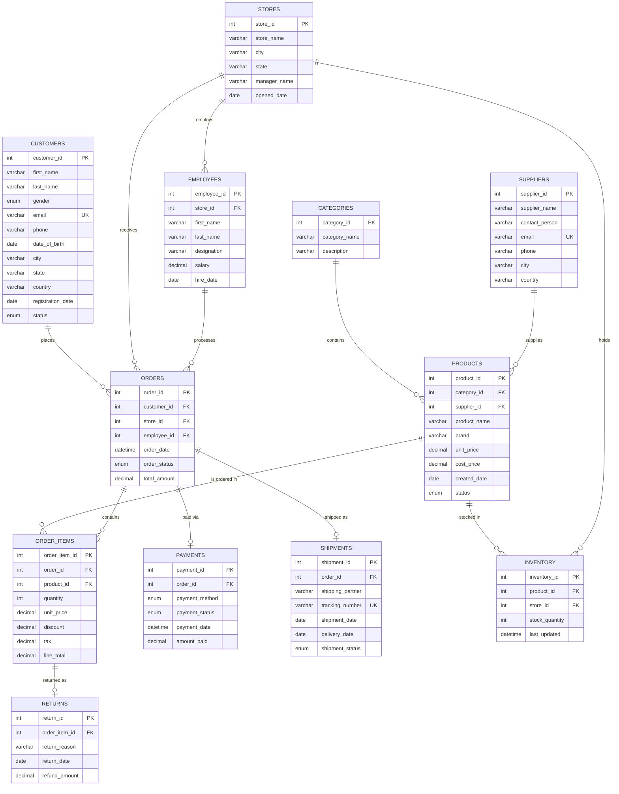

# Source OLTP Database Design

## Database: `retail_oltp`

## Overview

This document describes the transactional (OLTP) database that serves as the **source system** for our Retail ETL Pipeline. The database is designed to simulate a real-world e-commerce/retail company similar to Amazon, Flipkart, or Reliance Digital.

---

## ER Diagram (Mermaid)



---

## Table Relationships

| Parent Table | Child Table | Relationship | FK Column |
|---|---|---|---|
| customers | orders | One-to-Many | customer_id |
| stores | orders | One-to-Many | store_id |
| employees | orders | One-to-Many | employee_id |
| stores | employees | One-to-Many | store_id |
| categories | products | One-to-Many | category_id |
| suppliers | products | One-to-Many | supplier_id |
| orders | order_items | One-to-Many | order_id |
| products | order_items | One-to-Many | product_id |
| orders | payments | One-to-One | order_id |
| orders | shipments | One-to-One | order_id |
| order_items | returns | One-to-One | order_item_id |
| products | inventory | One-to-Many | product_id |
| stores | inventory | One-to-Many | store_id |

---

## Why Each Table Exists

### 1. `customers`
Stores all registered customer profiles. Every order must be associated with a customer. Supports customer segmentation, geographic analysis, and lifecycle tracking.

### 2. `categories`
Classifies products into logical groups (Electronics, Clothing, etc.). Enables category-level reporting, filtering, and inventory management.

### 3. `suppliers`
Tracks vendors who provide products. Supports supplier performance analysis, procurement tracking, and cost management.

### 4. `products`
The product catalog with pricing information. Central to the business — connects categories, suppliers, inventory, and order items.

### 5. `stores`
Physical retail locations. Each order and employee belongs to a store. Supports store-level performance comparison.

### 6. `employees`
Store staff who process orders. Enables employee performance tracking, workload analysis, and payroll.

### 7. `inventory`
Real-time stock levels per product per store. Supports stock alerts, reorder point calculations, and availability checks.

### 8. `orders`
The core transaction table. Records every customer purchase with timestamp, status, and total amount.

### 9. `order_items`
Line-level detail for each order. Stores product, quantity, pricing, discount, and tax per item. Enables product-level sales analysis.

### 10. `payments`
Payment records associated with orders. Tracks payment method, status, and amount. Supports financial reconciliation.

### 11. `shipments`
Delivery tracking for orders. Stores carrier info, tracking numbers, and delivery dates. Supports logistics analysis.

### 12. `returns`
Records product returns at the item level. Captures reason and refund amount. Supports return rate analysis and quality tracking.

---

## Normalization Explanation

This database is designed to **Third Normal Form (3NF)**:

### 1NF (First Normal Form)
- All columns contain atomic (single) values
- Each row is uniquely identified by a primary key
- No repeating groups or arrays

### 2NF (Second Normal Form)
- Satisfies 1NF
- All non-key columns are fully dependent on the entire primary key
- Example: `order_items` separates line-level data from order-level data

### 3NF (Third Normal Form)
- Satisfies 2NF
- No transitive dependencies — non-key columns depend only on the primary key
- Example: `supplier_name` is in `suppliers` table, not in `products` table
- Example: `category_name` is in `categories` table, not in `products` table

### Why 3NF for OLTP?
- **Minimizes data redundancy** — each fact is stored once
- **Prevents update anomalies** — changes only need one update
- **Ensures data integrity** — foreign keys enforce relationships
- **Optimized for writes** — INSERT/UPDATE operations are fast

---

## How This Database Supports ETL

This OLTP database is specifically designed as the **source system** for our ETL pipeline:

### Extract Phase
- Clean, well-structured tables make extraction straightforward
- Primary keys provide reliable row identification
- `order_date`, `registration_date`, and `last_updated` columns enable **incremental extraction**
- Status columns (`order_status`, `payment_status`) support **CDC (Change Data Capture)**

### Transform Phase
- Normalized structure requires JOINs, which the Transform layer will denormalize
- Price/cost columns enable margin calculations
- Geographic data (city, state) supports regional aggregation
- Date columns support time-based dimension building

### Load Phase (Target: Data Warehouse)
- Customer data → `dim_customer` (SCD Type 2)
- Product + Category + Supplier → `dim_product`
- Store data → `dim_store`
- Date columns → `dim_date`
- Orders + Items + Payments → `fact_sales`
- Returns → `fact_returns`
- Inventory → `fact_inventory_snapshot`

### ETL-Friendly Design Decisions
1. **AUTO_INCREMENT PKs** — Simple surrogate keys for extraction
2. **NOT NULL constraints** — Reduces null handling in transforms
3. **ENUM types** — Consistent status values, easy to map
4. **Datetime columns** — Enable incremental/delta loads
5. **Decimal precision** — Financial accuracy preserved through pipeline
6. **InnoDB engine** — Consistent reads during extraction (MVCC)

---

## Sample Data Summary

| Table | Record Count | Notes |
|---|---|---|
| customers | 100 | Realistic Indian names, multiple cities |
| categories | 10 | Standard retail categories |
| suppliers | 10 | One per category |
| products | 50 | 5 per category with real brands |
| stores | 5 | Major Indian cities |
| employees | 20 | 4 per store |
| inventory | 60 | Stock levels per product/store |
| orders | 500 | Distributed across 2024 |
| order_items | ~1000 | 1-4 items per order |
| payments | 500 | One per order |
| shipments | ~300 | For shipped/delivered orders |
| returns | ~40-80 | For returned order items |

---

## SQL Files

| File | Purpose |
|---|---|
| `create_database.sql` | Creates the `retail_oltp` database |
| `create_tables.sql` | Creates all 12 tables with proper data types |
| `constraints.sql` | Adds FK, UNIQUE, and CHECK constraints |
| `indexes.sql` | Creates performance indexes |
| `sample_data.sql` | Inserts realistic sample data |

### Execution Order

```bash
mysql -u root -p < sql/source/create_database.sql
mysql -u root -p retail_oltp < sql/source/create_tables.sql
mysql -u root -p retail_oltp < sql/source/constraints.sql
mysql -u root -p retail_oltp < sql/source/indexes.sql
mysql -u root -p retail_oltp < sql/source/sample_data.sql
```

Or combined:
```bash
mysql -u root -p < sql/source/create_database.sql
mysql -u root -p retail_oltp < sql/source/create_tables.sql
mysql -u root -p retail_oltp < sql/source/constraints.sql
mysql -u root -p retail_oltp < sql/source/indexes.sql
mysql -u root -p retail_oltp < sql/source/sample_data.sql
```

---

## Design Principles Applied

1. **Referential Integrity** — All FKs enforced with appropriate ON UPDATE/DELETE actions
2. **Data Validation** — CHECK constraints prevent invalid data entry
3. **Performance** — Indexes on commonly queried columns (dates, FKs, status)
4. **Scalability** — AUTO_INCREMENT, InnoDB engine, proper indexing
5. **Real-World Simulation** — Data patterns mirror actual e-commerce operations
6. **ETL-Ready** — Timestamps, status fields, and clean structure for pipeline extraction
